

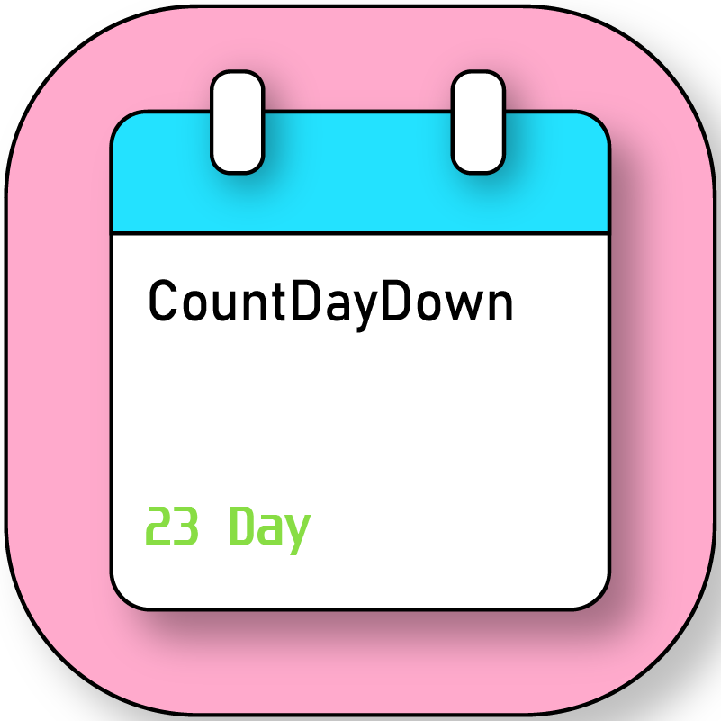

# CountDayDown：倒数日

<h3>
轻量化的 Android 倒数日卡片应用
</h3>

       -green?logo=android)  

---

# 简介

**CountDayDown：倒数日** 是一个用于记录生活中重要日期的 Android 应用。

你可以使用它：

- 记录未来的重要事件
- 保存过去值得纪念的瞬间
- 创建个性化倒数日卡片

简单、美观、易用。

---

# 软件功能

## 倒数日卡片

软件会以卡片形式展示你创建的日期，让重要事件更加直观。

点击主页左上角按钮，可以切换卡片大小。

大号卡片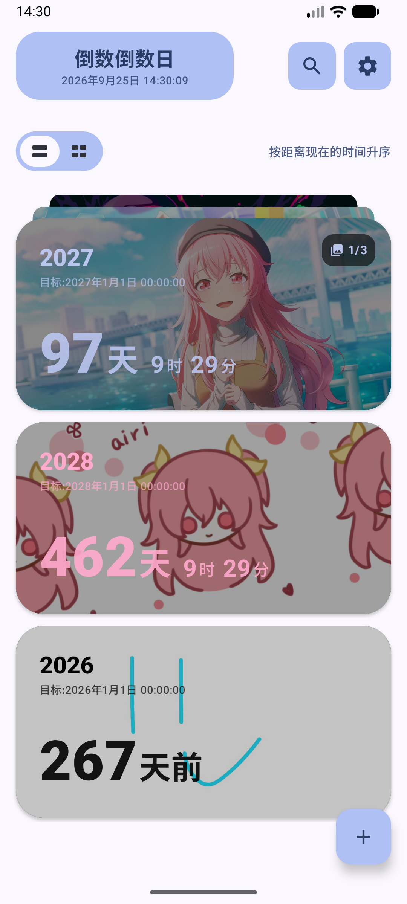 小号卡片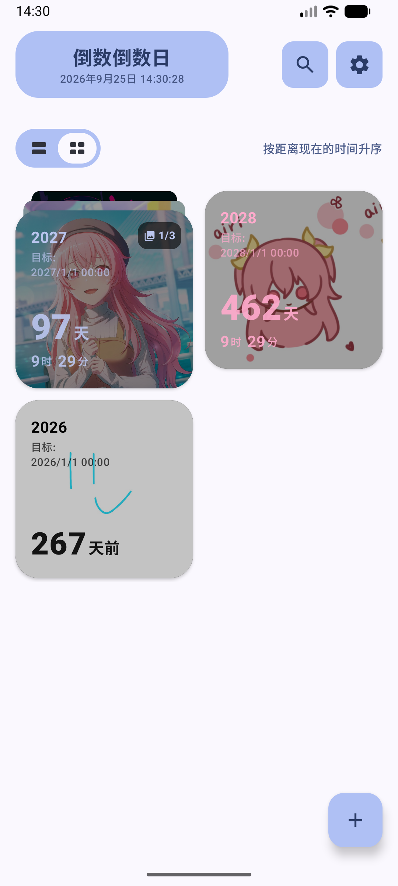

---

## 将卡片导出为图片

长按倒数日卡片进入菜单，选择 **导出为图片**。

即可将卡片保存为图片，方便分享。

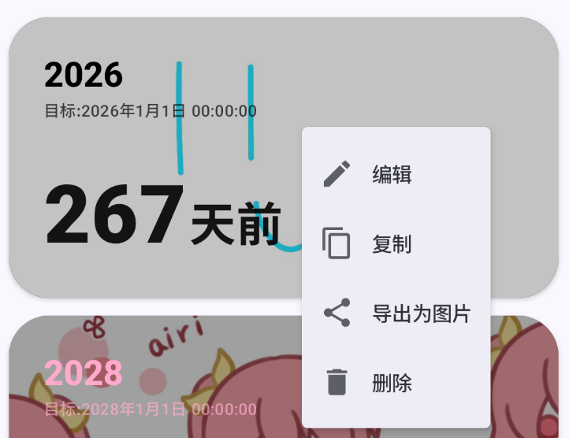

导出效果：

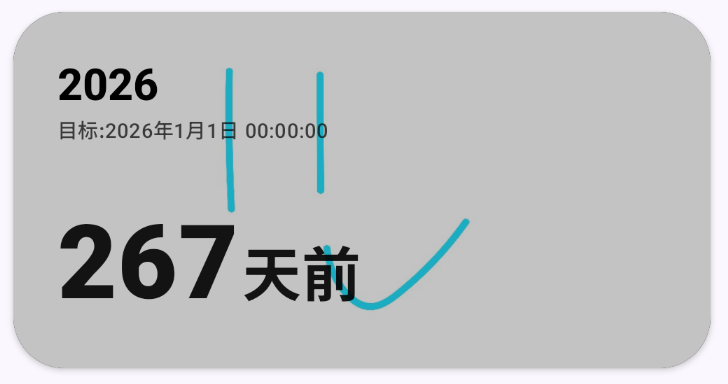 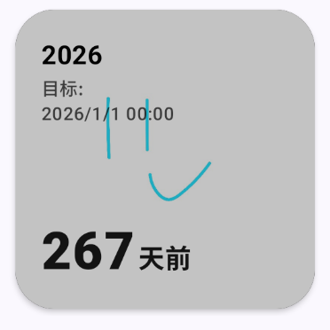

---

# 创建倒数日卡片

## 美化

支持：

- 🌈 自定义颜色
- 🖼️ 设置图片作为卡片背景
- 🔤 导入自定义字体

## 日期设置

支持：

- ↗️ 排除一周中的指定日期
- 🔁 循环倒数
- 🔔 通知提醒

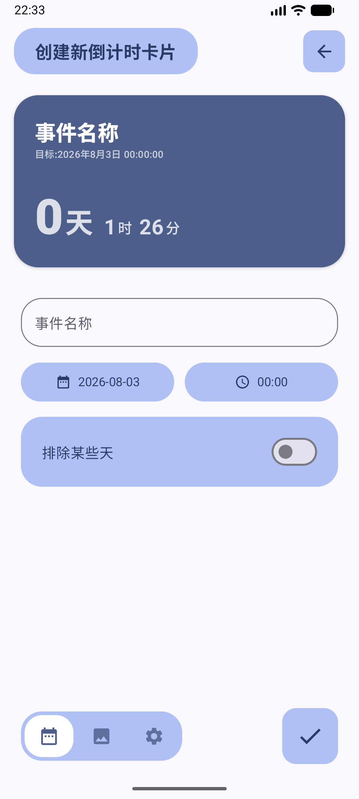 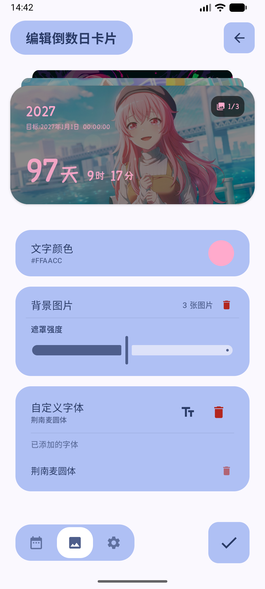 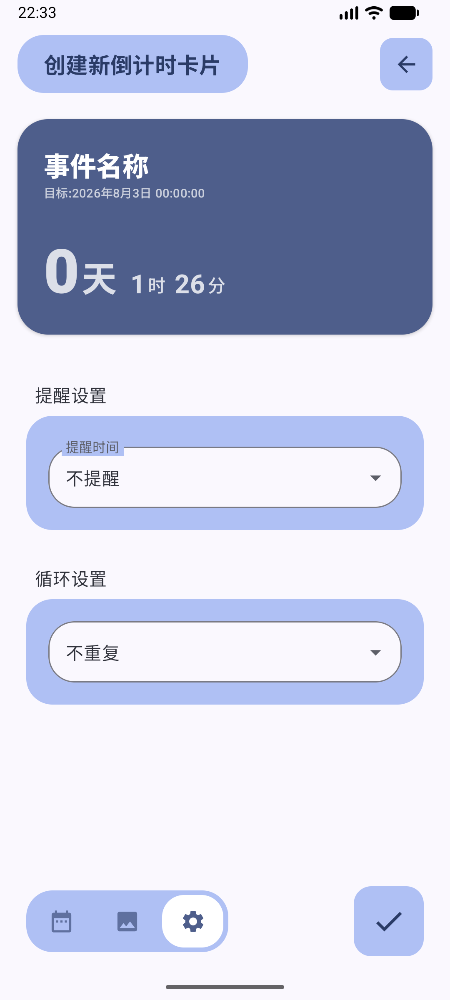

---

# 软件设置

## 应用美化

支持：

- 🌈 自定义软件主题色
- 🏞️ 自定义应用背景

## 管理通知

如果不希望被通知打扰，可以在设置中关闭通知功能。

## 数据备份

支持将以下内容备份为 ZIP 压缩包：

- 倒数日卡片
- 自定义背景图片
- 应用主题色
- 导入字体
- 软件配置

方便用户迁移数据。

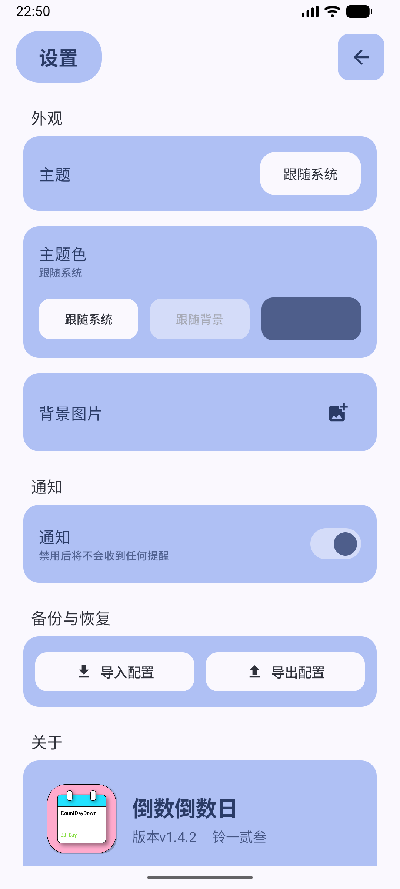

---

# 桌面小组件

> 目前桌面小组件仅适配 Android 原生小组件库。

支持两种大小的小组件：

- 2×2
- 4×2

显示效果与软件内倒数日卡片保持一致。

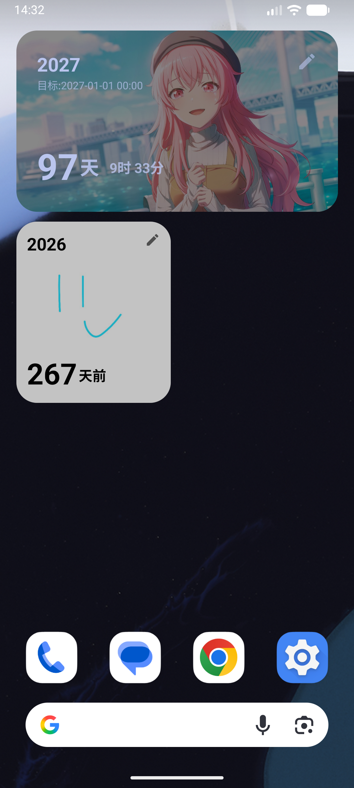

---

# 开始使用

---

# 开源协议

本项目采用 [**MIT License**](LICENSE) 开源。

你可以：

- ✅ 自由使用本项目
- ✅ 修改源代码
- ✅ 发布修改后的版本
- ✅ 用于商业项目

但需要：

- ❗ 保留原作者版权声明
- ❗ 保留 MIT License 协议文本

本项目以「现状」提供，作者不对软件的使用结果、稳定性或适用性提供任何明示或暗示的保证。

---

# 贡献

欢迎参与项目贡献：

---

# 鸣谢

**Gemini 3 Flash Preview** 在开发过程中提供代码辅助

**作者：铃一贰叁**

如果这个项目对你有帮助，欢迎 Star ⭐

