

Supported Language:🇨🇳 Chinese 🇺🇸 English 🇯🇵 Japanese 🇰🇷 Korean

 

 ---

# CountDayDown

<h3>

A lightweight Android countdown day application

</h3>

       -green?logo=android)  

# Introduction

**CountDayDown** is an Android application designed to record important dates in everyday life, featuring customizable reminder cards.

# Features

## Countdown Cards

The app displays the dates you create in the form of cards, making important events more intuitive

Large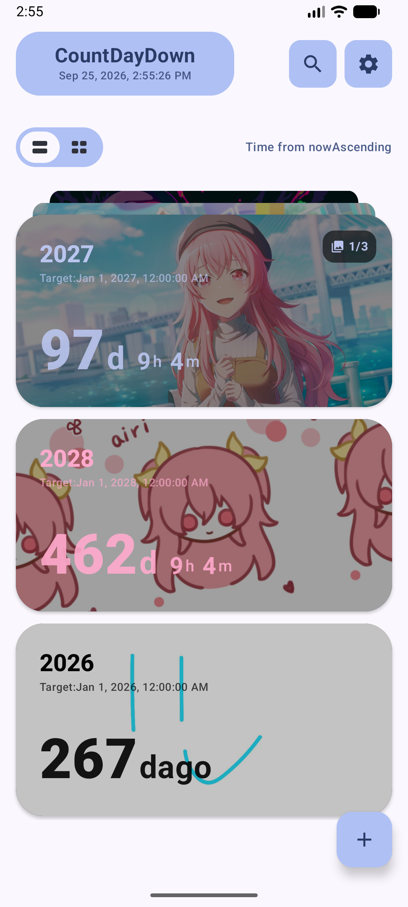 Small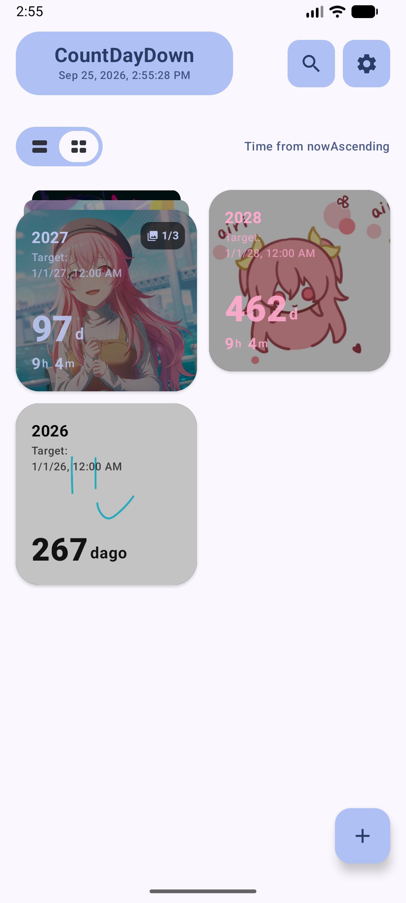

## Export Cards as Images

Long press a countdown day card to open the menu and select **Export as Image** to save the card as an image for easy sharing

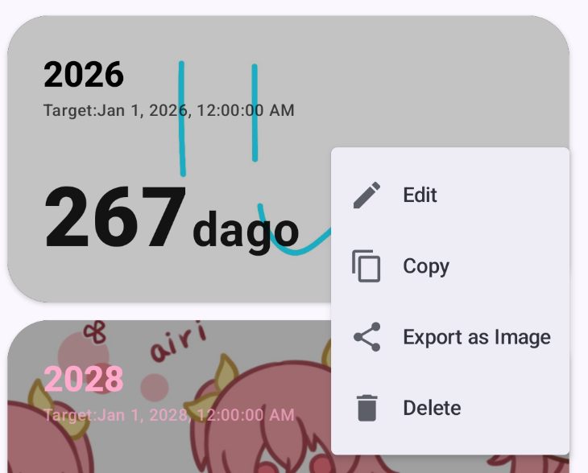

Sample:

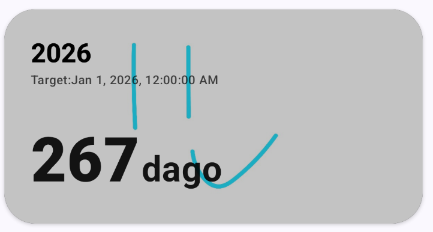 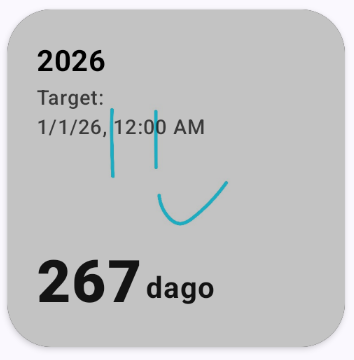 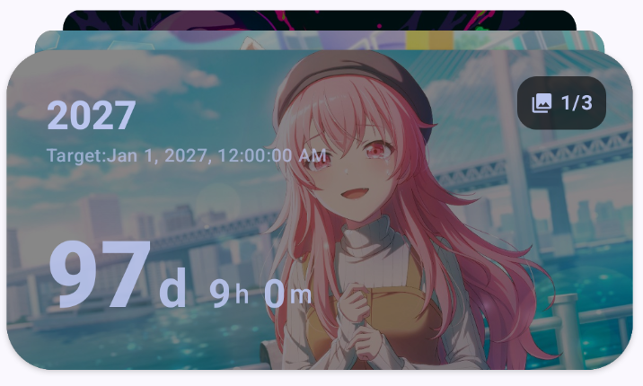

# Create Countdown Cards

## Customization

-   🌈 Custom colors
-   🖼️ Set images as card backgrounds
-   🔤 Import custom fonts

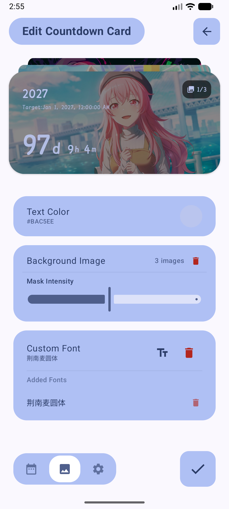

## Date Settings

-   ↗️ Exclude specified days of the week
-   🔁 Repeating countdowns
-   🔔 Notification reminders

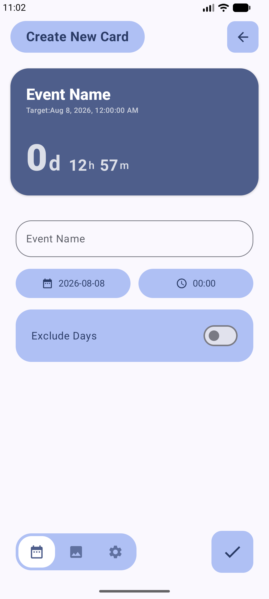   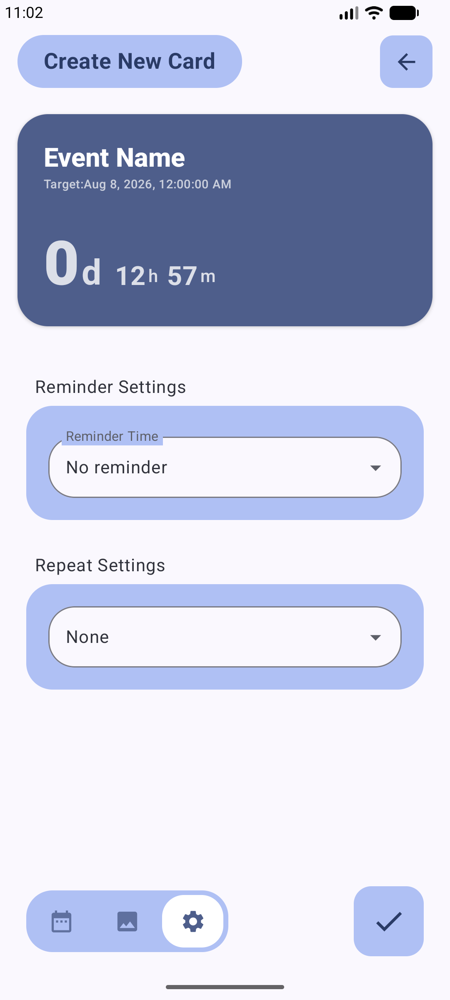

# App Settings

## App Customization

-   Light mode / Dark mode
-   🌈 Custom app theme colors
-   🏞️ Custom app background

## Manage Notifications

If you do not want to be disturbed by notifications, you can disable notification functions in settings

## Data Backup

Supports backing up the following content as a ZIP archive:

-   Countdown day cards
-   Custom background images
-   App theme colors
-   Imported fonts
-   App configurations

Convenient for users to migrate data

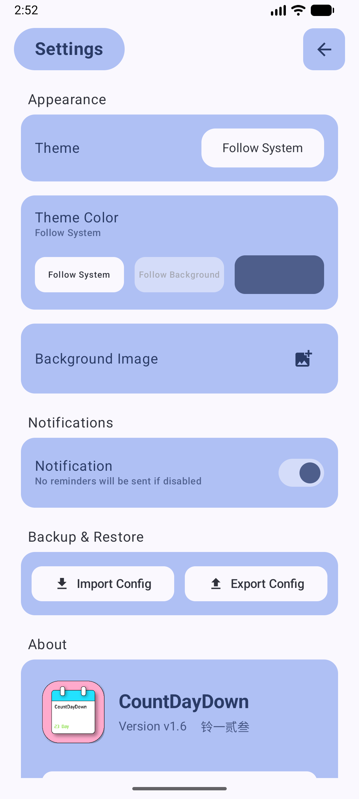 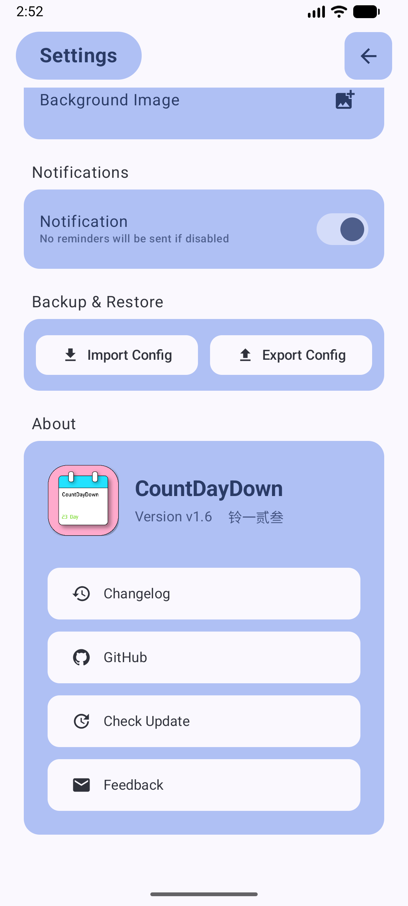

# Widgets

> Currently, home screen widgets only support the native Android widget library

Supports two widget sizes:

-   2×2
-   4×2

The display effect is consistent with the countdown day cards inside the app

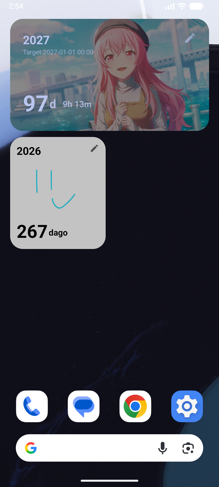

# Getting Started

### Release

### Download latest APK

### Changelog

# Contribution

Contributions are welcome:

Author Email: ZErO23_FeedBack@outlook.com

**Author: 铃一贰叁**

If this project helps you, feel free to Star ⭐

